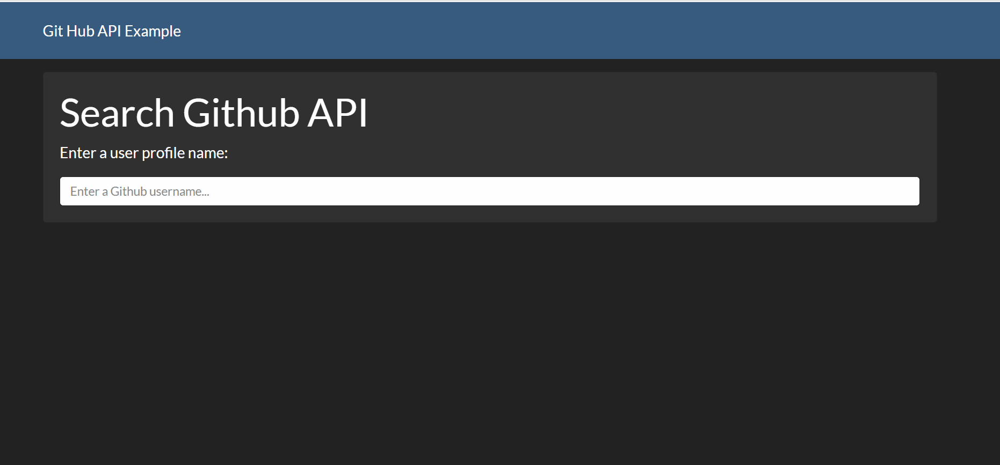

# GitHub-API
This is an example on how to use JavaScript to make HTTP requests to a web service - GitHub API Here. This example incorporates an existing CSS theme - bootswatch from the web. It is a responsive page that will automatically display the profile information of Github users.

### Walkthrough GIF
 

### Note
This project was done as part of the course work for Client-Server Programming at University of Washington, Tacoma.
Thanks to prof.Eyhab Al-Masri for introducing to us this cool and exciting project.
